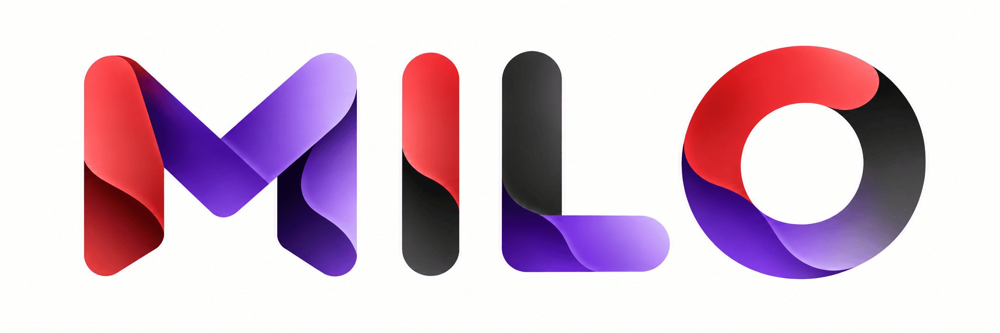

<p align="center">
  
</p>

# MILO

**Multiple Location Manager & Indexer for Obsidian**

[](LICENSE)

Store Obsidian attachments outside your vault while continuing to use normal wikilinks and embeds.

Keep large files such as PDFs, images, videos, and audio on an external drive or cloud-synced folder without filling your vault.

## Why MILO?

Large attachment collections can make Obsidian vaults unnecessarily large, especially when using Obsidian Sync.

MILO lets you separate your notes from your attachment storage:

```text
Obsidian Vault/
├── Notes/
└── Research/

External Drive/
└── Obsidian Attachments/
    ├── Papers/
    ├── Images/
    └── Videos/
````

Your notes still use normal embeds:

```markdown
![[research-paper.pdf]]
![[diagram.png]]
```

MILO resolves the files from your external location.

## Features

* Store attachments outside your vault
* Support external drives and cloud-synced folders
* Resolve images, audio, video, PDFs, and other attachments
* Search through subfolders
* Index filenames for faster lookups
* Show indicators for externally resolved attachments
* Customise indicator colours
* Optionally create symlinks inside the vault
* Native folder selection

## Example

Keep research papers on an external SSD:

```text
Research Vault/
├── Notes/
└── Literature/

External SSD/
└── Research PDFs/
    ├── paper-001.pdf
    ├── paper-002.pdf
    └── paper-003.pdf
```

Your notes can still contain:

```markdown
![[paper-001.pdf]]
```

MILO finds and resolves the file from the external location.

## MILO Free

The free version includes:

* One external attachment location
* Attachment resolution
* Subfolder search
* Filename indexing
* External attachment indicators
* Custom indicator colours
* Optional symlinks

## MILO Pro

MILO Pro includes everything in Free, plus:

* Multiple attachment locations
* Filetype-based attachment routing
* Moving attachments between locations
* Choosing a location when pasting or dropping files
* Additional attachment management features

Example routing:

```text
PDF              → Research PDFs
PNG, JPG, WEBP   → Images
MP4, MOV         → Videos
CSV, XLSX        → Datasets
```

MILO Pro is available with a one-time payment and lifetime licence.

[Upgrade to MILO Pro](https://dodo.pe/aq5yajoqmm7)


## How It Works

```text
Obsidian Note
     ↓
Attachment Reference
     ↓
    MILO
     ↓
Attachment Index
     ↓
External Location
     ↓
Attachment File
```

MILO separates the attachment reference from the physical file location.

## Getting Started

1. Install MILO from Obsidian Community Plugins.
2. Open **Settings → MILO**.
3. Add an external attachment location.
4. Select your attachment folder.
5. Configure search and indexing.
6. Continue using normal Obsidian links and embeds.


## Development

MILO Free is open source and available under the MIT License.

## Licence

MILO Free is licensed under the [MIT License](LICENSE).